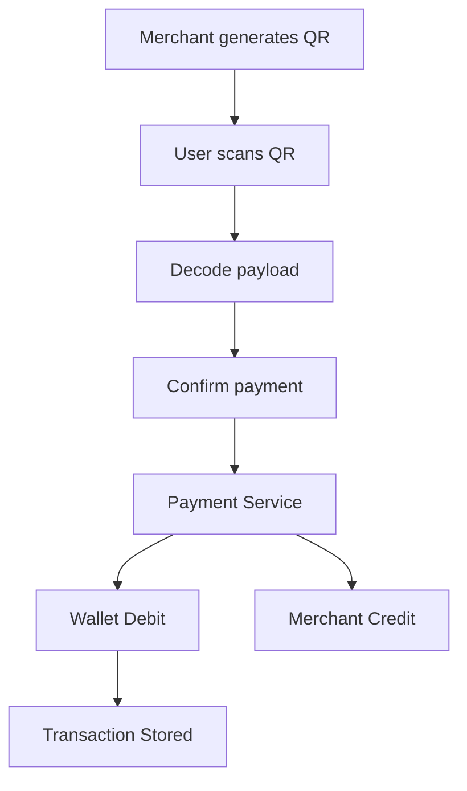
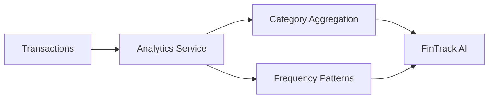
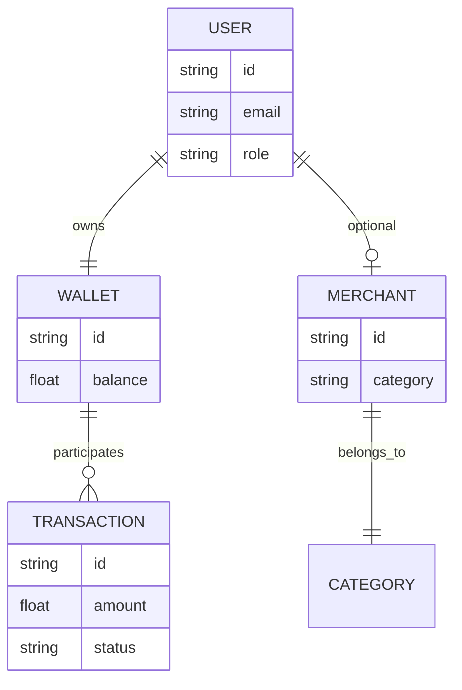

````markdown
# 🚀 PayFlow – Digital Wallet & Payment Ecosystem

> A **full-stack fintech simulation system** built to replicate real-world wallet/payment flows and act as a **data engine for AI-driven financial insights (FinTrack AI)**.

---

## 📌 Overview

**PayFlow** is a modular digital wallet system that enables:

- 💸 P2P money transfers  
- 🏪 Merchant payments  
- 📱 QR-based transactions  
- 💰 Wallet balance management  
- 📊 Transaction analytics export  

It is designed as a **portfolio-grade fintech system** showcasing:

- Scalable backend architecture  
- Transaction-safe design  
- Clean modular services  
- AI-ready data pipelines  

📄 Full SRS + Design Reference included in project docs.

---

## 🧠 System Vision

> “Build a lightweight, realistic payment ecosystem that generates structured financial data for AI systems.”

---

## 🏗️ High-Level Architecture (HLD)

```mermaid
flowchart TD
    A[Frontend - Next.js/React] --> B[API Gateway - Node.js/Express]

    B --> C1[Auth Service]
    B --> C2[User Service]
    B --> C3[Wallet Service]
    B --> C4[Payment Service]
    B --> C5[Merchant Service]
    B --> C6[Analytics Export Service]

    C4 --> C7[Transaction Service]

    C7 --> D[PostgreSQL Database]

    D --> E[FinTrack AI Layer]
````

---

## 🧩 Architecture Breakdown

### 🔹 Frontend

* Next.js + React
* Dashboard + Payments + QR flows
* Admin panels

### 🔹 Backend

* Node.js + Express (modular services)
* REST APIs
* JWT authentication

### 🔹 Database

* PostgreSQL (ACID-compliant)

### 🔹 AI Layer (Future)

* FinTrack AI consumes transaction data

---

## 📦 Core Modules

| Module         | Responsibility           |
| -------------- | ------------------------ |
| 🔐 Auth        | Login, Register, JWT     |
| 👤 User        | Profile & settings       |
| 💰 Wallet      | Balance, top-up          |
| 💸 Payment     | P2P + Merchant + QR      |
| 🏪 Merchant    | Onboarding + categories  |
| 📱 QR          | QR generation + decoding |
| 📊 Transaction | Ledger + history         |
| 🤖 Analytics   | AI export                |
| 🛡️ Admin      | Monitoring & control     |

---

## 🔄 Key System Flows

### 💸 P2P Transfer Flow

```mermaid
sequenceDiagram
    participant U1 as Sender
    participant API
    participant Wallet
    participant DB
    participant U2 as Receiver

    U1->>API: Send money
    API->>Wallet: Validate balance
    Wallet->>DB: Begin transaction
    Wallet->>DB: Debit sender
    Wallet->>DB: Credit receiver
    DB-->>Wallet: Commit
    Wallet-->>API: Success
    API-->>U1: Transaction complete
```

---

### 🏪 Merchant QR Payment Flow



---

### 🤖 FinTrack AI Data Flow



---

## 🧾 Database Design (Core Entities)



---

## 🧠 Core Entities

### 👤 User

* id, email, phone
* role (USER / MERCHANT / ADMIN)
* passwordHash

### 💰 Wallet

* balance
* currency
* userId

### 🏪 Merchant

* category
* QR payload

### 💸 Transaction

* type (P2P / MERCHANT / TOPUP)
* amount
* status

---

## 🔌 API Design

### 🔐 Auth

```http
POST /api/auth/register
POST /api/auth/login
```

### 💰 Wallet

```http
GET /api/wallet/balance
POST /api/wallet/topup
```

### 💸 Payments

```http
POST /api/payments/p2p
POST /api/payments/merchant
POST /api/payments/qr
```

### 📊 Transactions

```http
GET /api/transactions
GET /api/transactions/:id
```

### 🤖 Analytics

```http
GET /api/analytics/export/spending-history
GET /api/analytics/export/category-summary
```

---

## ⚙️ Transaction Processing Logic

### 💸 P2P Transfer (Atomic)

```pseudo
if balance < amount:
    reject

begin transaction
    debit sender
    credit receiver
    create transaction record
commit
```

---

## 🔐 Security Design

* 🔑 JWT Authentication
* 🔒 Password hashing (bcrypt/argon2)
* 🛡️ Role-based access control
* 🔁 Idempotent payments
* 📜 Audit logs

---

## 🚀 Tech Stack

### Frontend

* Next.js
* React
* Tailwind CSS
* Redux

### Backend

* Node.js
* Express
* TypeScript

### Database

* PostgreSQL

### Optional

* Redis (cache)
* Kafka (events)
* Python AI microservice

---

## 📊 System Characteristics

| Property        | Implementation          |
| --------------- | ----------------------- |
| ⚡ Performance   | < 2–3 sec transactions  |
| 🔒 Security     | JWT + hashing           |
| 🔁 Reliability  | ACID transactions       |
| 📈 Scalability  | Modular → microservices |
| 🧾 Auditability | Immutable logs          |

---

## 🧠 AI Integration (FinTrack AI)

PayFlow exports:

* 📅 Spending history
* 🏪 Merchant categories
* 🔁 Frequency patterns

### Example Insights

* Monthly spend trends
* Category-wise breakdown
* Micro-spending behavior
* Fraud/anomaly detection

---

## 📁 Folder Structure

### Frontend

```
payflow-frontend/
  app/
  components/
  services/
  hooks/
  store/
```

### Backend

```
payflow-backend/
  src/
    controllers/
    services/
    models/
    routes/
    middleware/
```
